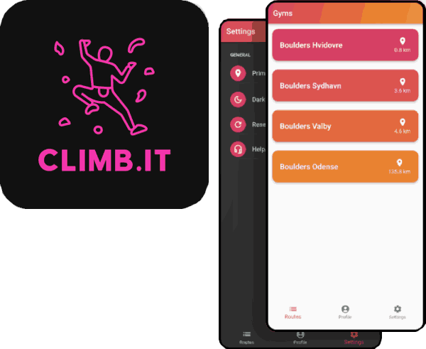

# climb.it

A bouldering/climbering companion app to discover new routes at your local gym.
Let's you keep track of completed routes by their difficulty,
allowing you to view your bouldering progress.

The application is built for Android and iOS using Flutter, and uses Firebase as a backend to
serve gym and route data.

**Course**: DTU: 02128 Software project

**Group members**:
- Christian Brix Saksager s224777
- Mads Christian Wrang Nielsen s224784
- Frederik Cayré Hede-Andersen s224807
- Oscar Svenstrup Nielsen s224812
- Jonathan Victor Flint s224770
- Melissa Safari s224818